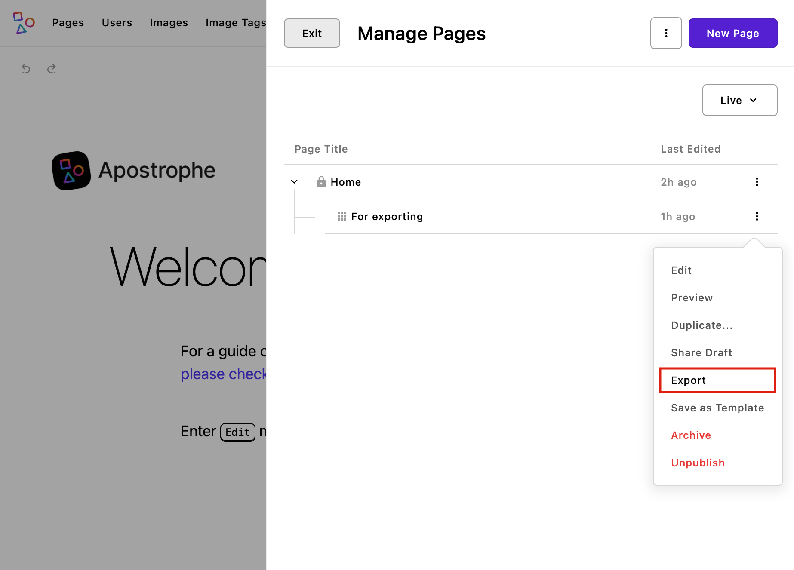
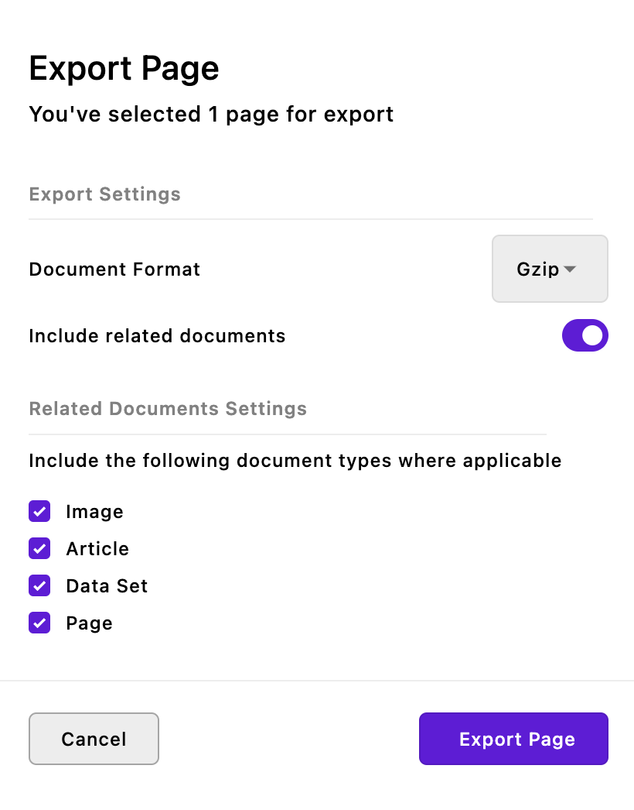
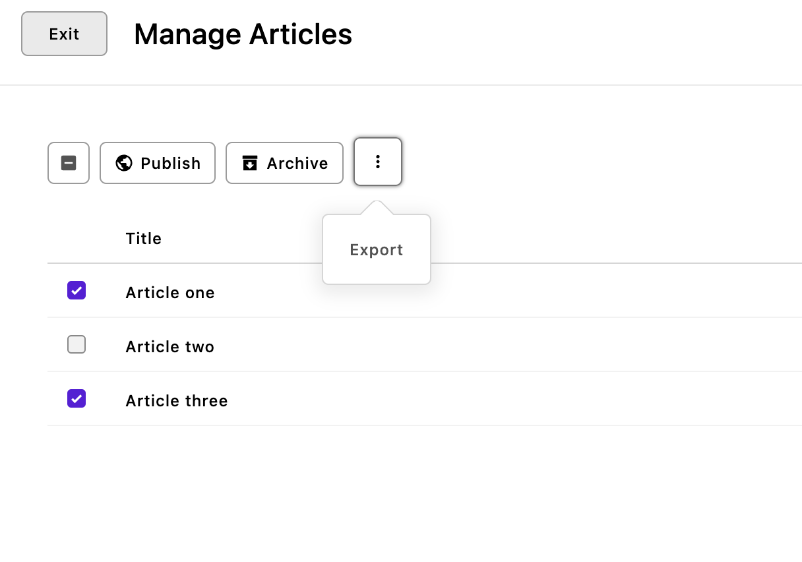
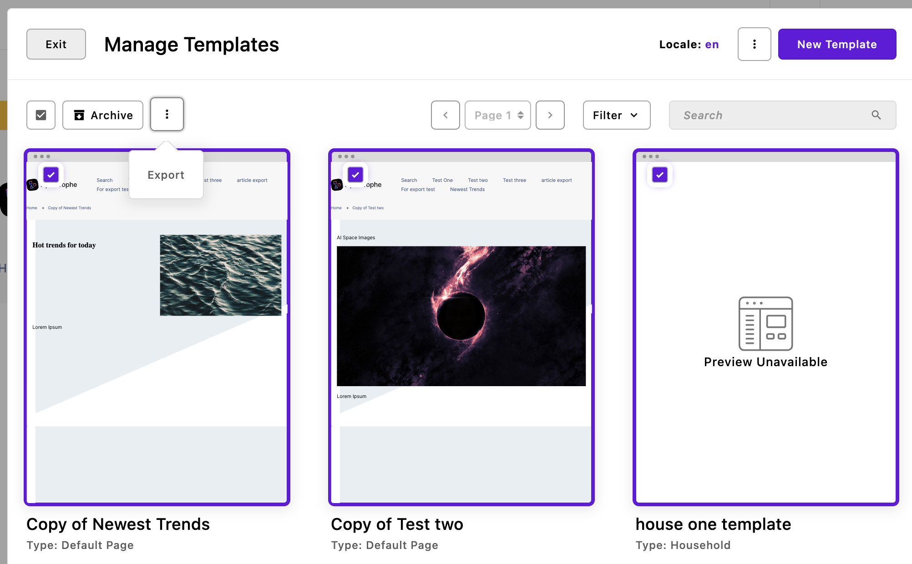
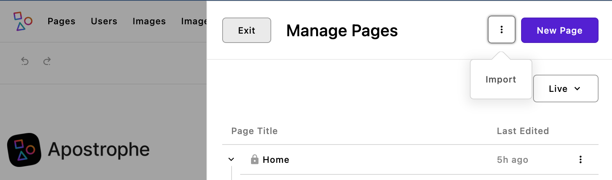
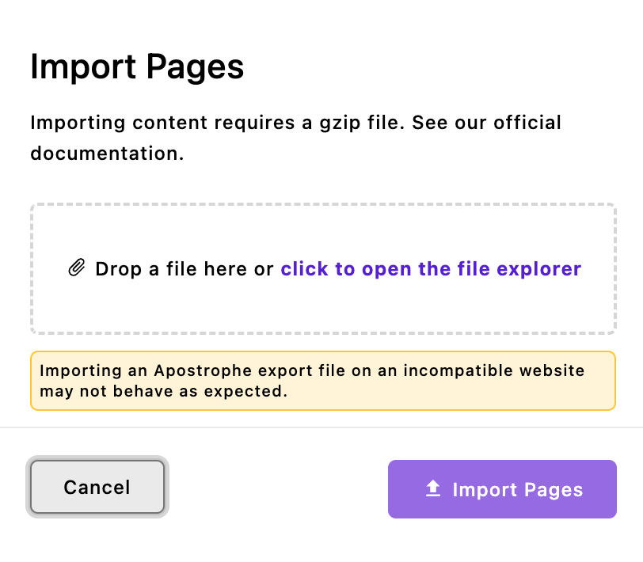

<div align="center">
  

  <h1>Apostrophe Import Export Module</h1>
  <p>
    <a aria-label="Apostrophe logo" href="https://v3.docs.apostrophecms.org">
      
    </a>
    <a aria-label="Join the community on Discord" href="http://chat.apostrophecms.org">
      
    </a>
    <a aria-label="License" href="https://github.com/apostrophecms/import-export/blob/main/LICENSE.md">
      
    </a>
  </p>
</div>

This A3 module enables import and export of pages and pieces, with or without related
documents such as files, images and other related types.

## Installation

To install the module, use the command line to run this command in an Apostrophe project's root directory:

```
npm install @apostrophecms/import-export
```

## Usage

Configure the module in the `app.js` file:

```javascript
require('apostrophe')({
  shortName: 'my-project',
  modules: {
    '@apostrophecms/import-export': {}
  }
});
```
## Exporting Files

### Pages


Pages can currently only be exported singly. When exporting a page it will retain its publication status upon import. A page that is published when exported will be published on import, while draft pages will remain in draft status. In order to export a page, you use the context menu to the right of each page in the manager.

Exporting the parent page in a set of nested documents will **not** export the child pages. Each child page must be exported separately. The parent page must already exist, or be separately exported and then subsequently imported, for any child page to appear in the page manager of the import project.

<hr>



Clicking export will bring up a modal with two input controls.

The first is for selecting the file format to use for the exported file. Currently, the module only exports in the `.tar.gz` format, but this will possibly be expanded in the future.

The second input toggles whether documents associated with the page, like images, files, pieces, or relationships, should be included in the download. Any or all can be unselected.Note that this doesn't mean that the particular page includes all of those documents types, just that those document types both exist in your project and aren't disabled for export.

Clicking on the "Export Page" button will trigger a download of the export file to your local computer.

<hr>

### Pieces


Unlike pages, piece-types can be exported either individually from the context menu to the right of the piece, or as a batch using the context menu above the pieces list in the manager. For example, in the image above two articles have been selected for export.

Clicking export will bring up the same modal that appears when exporting pages, allowing for the selection of related documents that should also be exported.

<hr>

### Templates


If you have the [Template Library Pro](https://apostrophecms.com/extensions/template-library) module installed, templates are exported by selecting one or more within the template manager and then using the context menu located to the right of the batch operations. Like with the piece-type exporter you can elect to batch export just one or multiple files depending on how many are checked.

Clicking export will bring up the same modal that appears when exporting pages, allowing for the selection of related documents that also should be exported.

<hr>

## Importing files


Any export file, no matter the content, can be imported using the utility context menu located at the top of the content managers, typically located to the left of the button to add new content of that type. This includes the page manager, any piece manager, or the document template manager if installed.



Clicking on the "Import" menu item will bring up a modal to select the export file you wish to import. You can only select one file at a time and the selection of an additional file will replace the first. After you select the exported file and click on the import button, a progress bar will be shown and a success or failure notification when the file has been fully imported.

If the file you select has documents that already exist in your project, you'll get a notification and list of the documents that would be over-written. From that list you can choose documents you don't want imported. Note, if you have any documents that were previously published and then archived, they will trigger a duplicate overwrite warning.

When importing a whole set of nested pages, the child pages will be added to the database, but will not appear in the page manager until the parent page has been imported. The parent page does not have to be imported first. Once it has been imported, any child pages that have already been imported will appear in the page manager.

Warning - While you can rename the exported file, you must not change the file extension (`.tar.gz`) or content, or the import might not go as planned. You will also get an error when trying to import an incompatible file made with another file exporter, a file with an incorrect extension, or a file made with a version of the `Import/Export` module that has breaking changes from the currently installed version.

>One caveat of sharing documents between sites is that the modules for page-types and piece-types must be the same in each. For example, if site A is using a page-type of `contact-page`, a page of that type can only be imported into a site that also has a `contact-page` module. If the codebase of the two projects are significantly different, it can either cause the import to fail, or some data to be lost if schema fields can't be reconciled.

### Permissions

Any user that can publish a document can export and import documents of that same type. Users who can only create or modify documents of a specific type will not be import documents, but they will be able to export documents of that same type.

### Options

You can disable the export and/or the import for any page- or piece-type using the `importExport` option. This option takes an object with `import` and `export` keys that take both can take boolean values.

```javascript
module.exports = {
  extend: '@apostrophecms/piece-type',
  options: {
    importExport: {
      import: true,
      export: false
    },
    label: 'Article',
    pluralLabel: 'Articles'
```

In this example, the 'Article' piece-type can be imported from a file, but users won't be allowed to export any of this type. This will also cause the export option to disappear from both the batch and individual 'Article' piece context menus in the 'Article' piece-type manager. Note that this will not impact other piece-types. The removal of the export menus from the respective managers will also occur if page-type or document templates are disabled for exporting. Finally, any disabled document type will not appear on the list of related documents.

Disabling a document type from being imported will remove the utility context menu from the respective document manager. It will also block insertion of any documents of that type when importing from the context menu of another manager. Finally, any export file that contains a related document type that is disabled for import, will still successfully import for those document types that are allowed.

The `export` key can also take an object with an `expiration` property. The value of this property sets how long the export file will persist before being deleted. The default is 60000ms (10 min.), but can be extended if it is anticipated that the download will be delayed for some reason.

```javascript
module.exports = {
  extend: '@apostrophecms/piece-type',
  options: {
    importExport: {
      import: true,
      export: {
        expiration: 60000
      }
    },
    label: 'Article',
    pluralLabel: 'Articles'
```
